# Architecture

> Status: Non-authoritative snapshot.
> Agent rule: Do not use this file as implementation context unless the user explicitly asks to update architecture docs.

> Generated from codebase analysis. Update when significant structural changes are made.
> Sections without current content are omitted; numbering follows the [arc42](https://arc42.org) template.

---

## 3. System Scope and Context

### 3.1 Overview

Actors and the three applications they interact with.

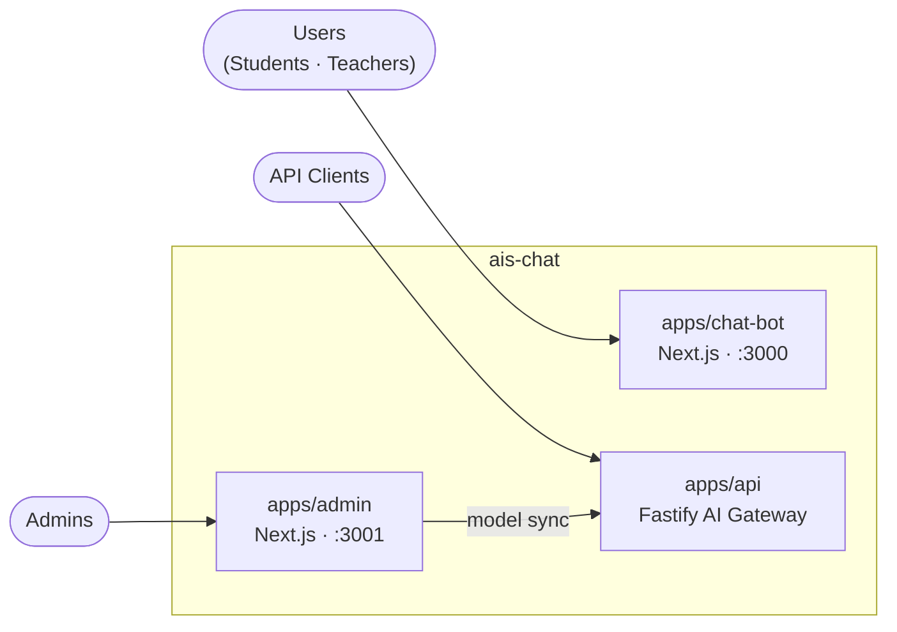

### 3.2 apps/chat-bot context

The main user-facing web application. A Next.js app with the App Router used by students and teachers.

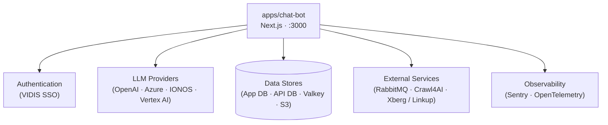

### 3.3 apps/admin context

The admin web application. A Next.js app that allows admins to configure the system — federal state settings, models, and more.

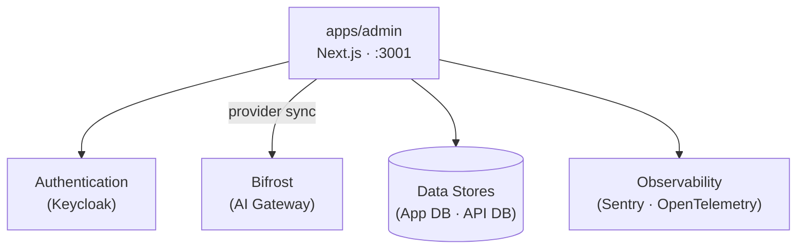

### 3.4 apps/api context

Fastify REST API acting as a proxy to LLM providers, handling billing and access control. Swagger docs are served at `/docs`.

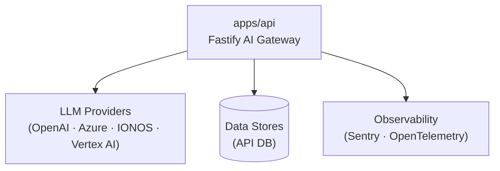

> **Note:** `apps/chat-bot` calls LLM providers directly via `@ais-chat/ai-core` (not through `apps/api`). `apps/api` is the AI gateway for external API clients and is also called by `apps/admin` to sync the LLM model catalog (knotenpunkt).

---

## 5. Building Block View

Internal `@ais-chat/*` dependencies. `@ais-chat/eslint-config` and `@ais-chat/typescript-config` are dev-only and omitted.

### 5.1 High-level package graph

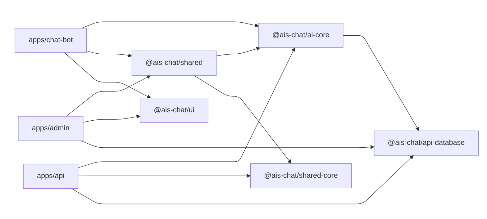

### 5.2 Frontend/client package view

Runtime dependencies used by browser-facing applications (`apps/chat-bot`, `apps/admin`).

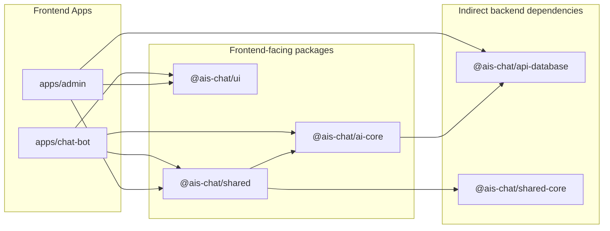

### 5.3 Backend/server package view

Runtime dependencies used by server-side API execution paths.

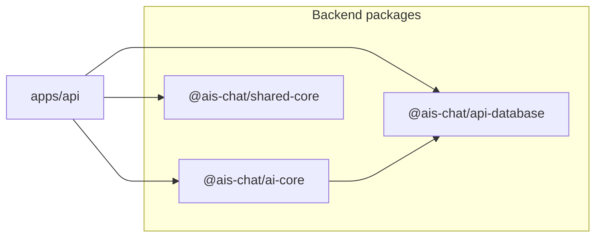

### 5.4 Package internals

#### 5.4.1 Cross-package module flow

Cross-package call flow through the three tightly coupled runtime packages. `@ais-chat/ui` and `@ais-chat/shared-core` are standalone utility packages covered separately in 5.4.4.

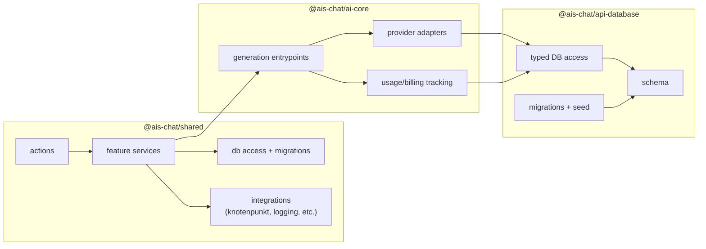

#### 5.4.2 `@ais-chat/shared`

Shared code used by `apps/chat-bot` and `apps/admin`. Contains the App DB schema, Drizzle ORM configuration, database access functions, services, and utilities. Internally split between frontend-facing entrypoints and backend/integration concerns.

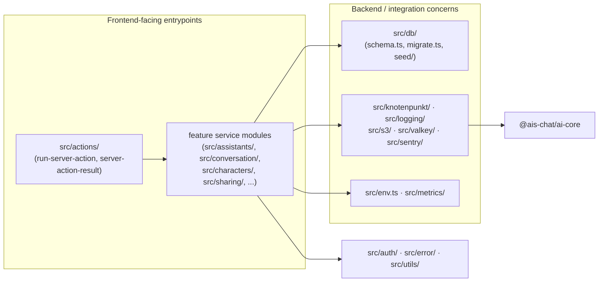

#### 5.4.3 `@ais-chat/ai-core`

Logic to communicate with AI providers and LLMs. Handles chat completions, embeddings, image generation, and API key management including billing and access control. Below is the internal request pipeline from callers to providers and usage tracking.

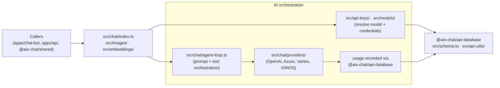

#### 5.4.4 `@ais-chat/ui`

`@ais-chat/ui` is the shared UI component library based on [shadcn/ui](https://ui.shadcn.com/), providing reusable React components and global Tailwind styles used across `apps/chat-bot` and `apps/admin`.

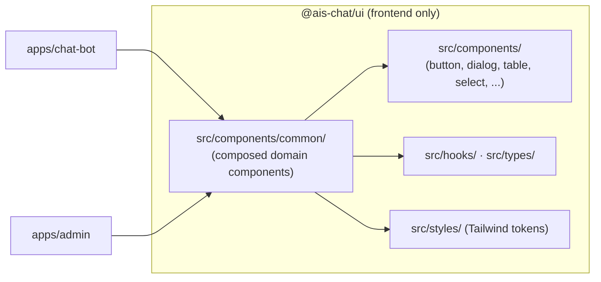

#### 5.4.5 `@ais-chat/shared-core`

`@ais-chat/shared-core` contains cross-app, framework-agnostic utilities used by all three applications.

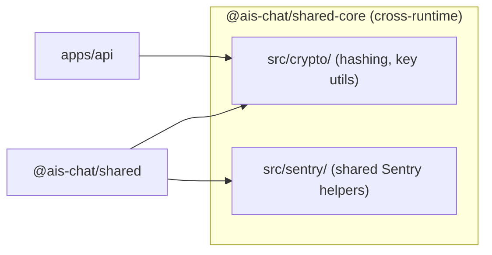

### 5.5 Database architecture

The system uses two separate PostgreSQL databases with distinct responsibilities.

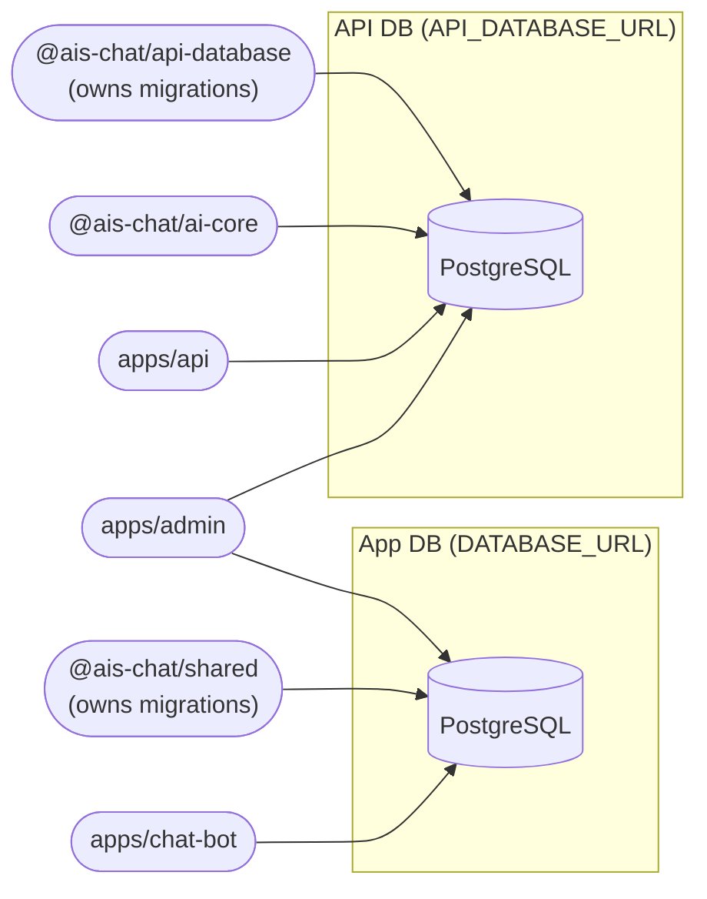

#### App DB — Core entities

Core user-facing domain tables. Audit columns (`created_at`, `updated_at`, `is_deleted`, `suspended`) omitted for brevity.

Note: `assistant` has no direct FK to `llm_model` in the App DB schema. For assistant chats, the active model is selected at runtime by chat request/model resolution logic.

Table structure:

```mermaid
erDiagram
    user_entity {
        uuid id PK
        enum user_role
        text federal_state_id FK
        text last_used_model
        int version_accepted_conditions
    }
    federal_state {
        text id PK
        int teacher_price_limit
        int student_price_limit
        uuid api_key_id
        int chat_storage_time
        json feature_toggles
        json design_configuration
    }
    llm_model {
        uuid id PK
        text provider
        text name
        text display_name
        text description
        json price_metadata
        bool is_new
    }
    conversation {
        uuid id PK
        text name
        uuid user_id FK
        uuid character_id FK
        uuid learning_scenario_id FK
        uuid assistant_id FK
        enum type
        timestamp deleted_at
    }
    conversation_message {
        uuid id PK
        uuid conversation_id FK
        uuid user_id FK
        text content
        text model_name
        enum role
        int order_number
        json tool_calls
    }
    character {
        uuid id PK
        text name
        text author
        uuid user_id FK
        uuid model_id FK
        enum access_level
        text instructions
        text description
        bool has_link_access
    }
    assistant {
        uuid id PK
        text name
        text author
        uuid user_id FK
        enum access_level
        text system_prompt
        text description
        bool is_web_search_enabled
    }
    learning_scenario {
        uuid id PK
        text name
        text author
        uuid user_id FK
        uuid model_id FK
        enum access_level
        text student_exercise
        bool has_link_access
    }
```

Relationships (ownership/context):

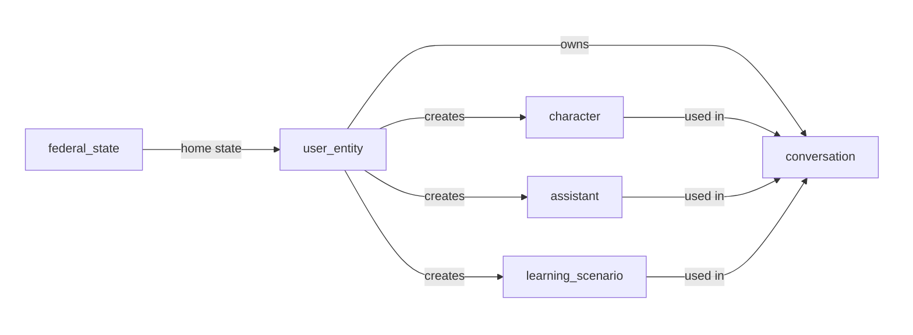

Relationships (chat + model wiring):

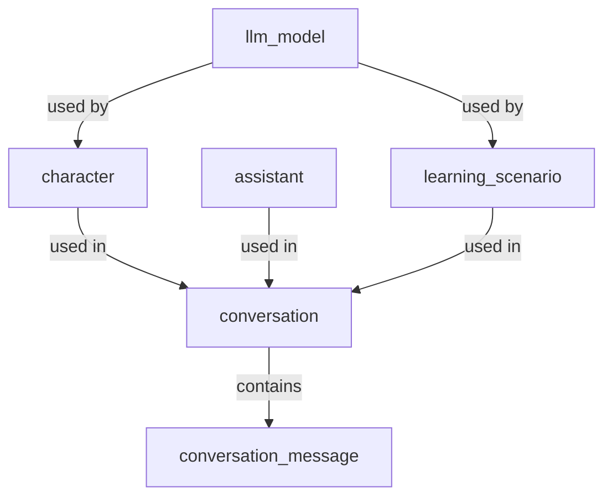

#### App DB — Supporting tables

Sharing sessions, config, model assignment, usage tracking and moderation. FK columns reference core entities above.

Table structure:

```mermaid
erDiagram
    federal_state_llm_model_mapping {
        uuid id PK
        text federal_state_id FK
        uuid llm_model_id FK
    }
    character_template_mappings {
        uuid character_id FK
        text federal_state_id FK
    }
    learning_scenario_template_mappings {
        uuid learning_scenario_id FK
        text federal_state_id FK
    }
    shared_character_conversation {
        uuid id PK
        uuid character_id FK
        uuid user_id FK
        text invite_code UK
        int token_points_limit
        int max_usage_time_limit
        timestamp started_at
        timestamp expired_at
        timestamp manually_stopped_at
    }
    shared_learning_scenario {
        uuid id PK
        uuid learning_scenario_id FK
        uuid user_id FK
        text invite_code UK
        int token_points_limit
        int max_usage_time_limit
        timestamp started_at
        timestamp expired_at
        timestamp manually_stopped_at
    }
    suspension_request {
        uuid id PK
        uuid character_id FK
        uuid assistant_id FK
        uuid learning_scenario_id FK
        uuid requester_id FK
        enum reason
        varchar description
        bool checked
    }
    info_banner {
        uuid id PK
        enum type
        text message
        text button_label
        text button_url
        timestamp starts_at
        timestamp ends_at
        int max_login_count
    }
    info_banner_federal_state_mapping {
        uuid info_banner_id FK
        text federal_state_id FK
    }
    info_banner_user_state {
        uuid info_banner_id FK
        uuid user_id FK
        int login_count
    }
    tool_call_cost {
        enum tool_call_name PK
        double costs_in_cent
    }
    conversation_usage_tracking {
        uuid id PK
        uuid conversation_id
        uuid user_id
        uuid model_id FK
        int completion_tokens
        int prompt_tokens
        double costs_in_cent
    }
    shared_learning_scenario_usage_tracking {
        uuid id PK
        uuid learning_scenario_id
        uuid user_id
        uuid model_id FK
        int completion_tokens
        int prompt_tokens
        double costs_in_cent
    }
    shared_character_chat_usage_tracking {
        uuid id PK
        uuid character_id
        uuid user_id
        uuid model_id FK
        int completion_tokens
        int prompt_tokens
        double costs_in_cent
    }
```

Relationships:

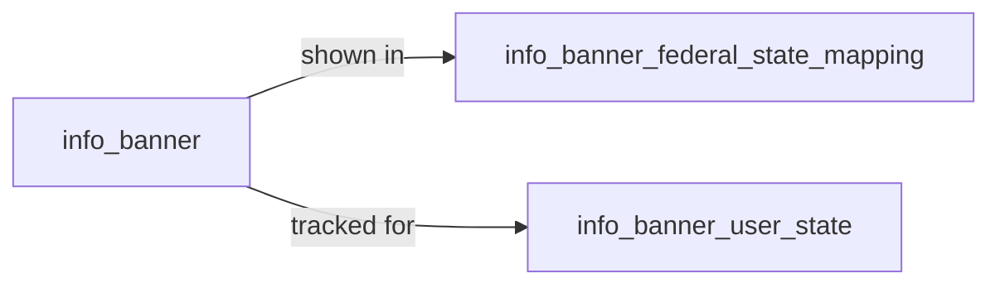

#### API DB

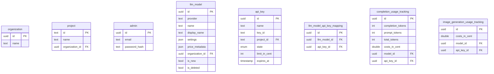

Relationships:

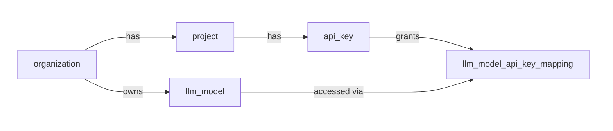

Usage tracking relations:

```mermaid
graph LR
    subgraph col1[" "]
        llm_model["llm_model"]
        api_key["api_key"]
    end

    subgraph col2[" "]
        completion_usage_tracking["completion_usage_tracking"]
        image_generation_usage_tracking["image_generation_usage_tracking"]
    end

    style col1 fill:none,stroke:none
    style col2 fill:none,stroke:none

    api_key -->|billed to| completion_usage_tracking
    api_key -->|billed to| image_generation_usage_tracking
    llm_model -->|used for| completion_usage_tracking
    llm_model -->|used for| image_generation_usage_tracking
```

### 5.6 Type landscape

Overview of the main type sources used across applications and packages. This subsection is intentionally focused on where canonical types come from and how they flow, not on listing every exported type.

#### 5.6.1 Type source map

| Area                                    | Primary source files                                                                | Type pattern                                                                                               |
| --------------------------------------- | ----------------------------------------------------------------------------------- | ---------------------------------------------------------------------------------------------------------- |
| App DB domain types                     | `packages/shared/src/db/schema.ts`                                                  | Drizzle table definitions + Zod schemas + inferred models (`*SelectModel`, `*InsertModel`, `*UpdateModel`) |
| API DB domain types                     | `packages/api-database/src/schema.ts`                                               | Drizzle table definitions + `$inferSelect` / `$inferInsert` model types                                    |
| AI chat contract types                  | `packages/ai-core/src/chat/types.ts`                                                | Explicit TypeScript aliases for messages, tools, stream events, token usage                                |
| AI image/embedding contract types       | `packages/ai-core/src/images/types.ts`, `packages/ai-core/src/embeddings/types.ts`  | Provider-agnostic request/response aliases                                                                 |
| API request validation types            | `apps/api/src/routes/(app)/v1/**/post.ts`, `apps/api/src/routes/(app)/v1/**/get.ts` | Zod runtime validation + `z.infer` request types                                                           |
| Shared auth and cross-feature app types | `packages/shared/src/auth/user-model.ts`, `packages/shared/src/db/types.ts`         | Shared service-facing aliases and compositional app models                                                 |

#### 5.6.2 High-level type flow

```mermaid
graph LR
    appdb["App DB types\npackages/shared/src/db/schema.ts"]
    apidb["API DB types\npackages/api-database/src/schema.ts"]
    aitypes["AI core types\npackages/ai-core/src/**/types.ts"]
    apiroutes["API route request types\napps/api/src/routes/**"]
    chatapp["apps/chat-bot"]
    adminapp["apps/admin"]
    apiapp["apps/api"]

    appdb --> chatapp
    appdb --> adminapp
    appdb --> apiapp

    apidb --> apiapp
    apidb --> aitypes

    aitypes --> chatapp
    aitypes --> apiapp

    apiroutes --> apiapp
```

#### 5.6.3 Canonical patterns currently used

1. Database-backed domain types in shared are generated from table schemas and exposed as `*SelectModel`, `*InsertModel`, and `*UpdateModel` aliases.
2. API DB models are inferred directly from Drizzle tables (`$inferSelect`, `$inferInsert`) and used in API-facing services.
3. Request bodies in `apps/api` are validated with Zod in route handlers; static request types are derived via `z.infer` from the same schemas.
4. AI-core uses explicit TypeScript aliases for chat/message/tool/stream contracts to keep provider integrations consistent.

#### 5.6.4 Semantic overlap in type information

The following domains contain same or very similar information represented by separate type families:

| Information domain             | Type families / locations                                                                                                                                                                                                                                                   | Overlap                                                                                                                                                                       |
| ------------------------------ | --------------------------------------------------------------------------------------------------------------------------------------------------------------------------------------------------------------------------------------------------------------------------- | ----------------------------------------------------------------------------------------------------------------------------------------------------------------------------- |
| UI design configuration        | `packages/shared/src/db/types.ts` (`DesignConfiguration`), `packages/ui/src/types/design-configuration.ts` (`DesignConfigurationSchema` + inferred type)                                                                                                                    | Same four color fields (`primaryColor`, `primaryTextColor`, `secondaryColor`, `secondaryTextColor`) represented in both shared and UI layers.                                 |
| LLM price metadata             | `packages/shared/src/db/types.ts` (`LlmModelPriceMetadata` via `KnotenpunktPriceMetadata`), `packages/api-database/src/types.ts` (`llmModelPriceMetadataSchema` + inferred type)                                                                                            | Both model text/image/embedding pricing information with parallel structures and variant logic.                                                                               |
| Entity classification          | `packages/shared/src/entities/entity-types.ts` (`EntityType`, `UrlEntityType`), `apps/chat-bot/src/components/hooks/use-persisted-overview-filter.ts` (local `EntityType`)                                                                                                  | Same conceptual entity set (assistant/character/learning scenario) expressed in multiple string-union formats (domain form, URL form, pluralized UI form).                    |
| Chat/file metadata             | `packages/shared/src/utils/chat.ts` (`FileMetadata`, `ConversationMessageMetadata`), `packages/shared/src/db/schema.ts` (`FileMetadata`)                                                                                                                                    | Both represent file-related metadata for conversation content, but one is a concrete chat payload shape while the DB-side alias is unconstrained (`Record<string, unknown>`). |
| Token usage and billing        | `packages/ai-core/src/chat/types.ts` (`TokenUsage`), `packages/ai-core/src/embeddings/types.ts` (`EmbeddingUsage`), `packages/ai-core/src/images/types.ts` (`Usage`), usage tracking models in `packages/api-database/src/schema.ts` and `packages/shared/src/db/schema.ts` | Prompt/completion/total token counts and cost fields recur across runtime contracts and persistence models with modality-specific variations.                                 |
| Chat message contract          | `packages/ai-core/src/chat/types.ts` (`Message`, `ChatAttachment`), `apps/api/src/routes/(app)/v1/chat/completions/post.ts` (request message schema), `apps/api/src/ai-core-adapter/messages.ts` (mapping layer)                                                            | Role/content/attachment semantics are modeled both as public API request schema and internal ai-core contract, requiring explicit transformation.                             |
| Error-result transport pattern | `packages/shared/src/utils/error.ts` (`Result<T>`, `AsyncResult<T>`), `packages/api-database/src/api-utils/error.ts` (`Result<T>`, `AsyncResult<T>`)                                                                                                                        | Same tuple-based success/error transport is implemented independently in multiple packages.                                                                                   |

#### 5.6.5 Terminology overlap analysis: `custom-chat` vs `entity`

The same conceptual object family (assistant, character, learning scenario) is currently described with multiple naming systems.

| Naming system | Representative locations                                                                                                                                                                                    | Typical forms                                          | Semantic scope in practice                                                                                                      |
| ------------- | ----------------------------------------------------------------------------------------------------------------------------------------------------------------------------------------------------------- | ------------------------------------------------------ | ------------------------------------------------------------------------------------------------------------------------------- |
| `custom-chat` | `apps/chat-bot/src/components/custom-chat/**`, `apps/chat-bot/src/app/api/chat/chat-service.ts` (`CustomChatIds`), `packages/shared/src/auth/authorization-service.ts` (`filterReadableCustomChats`)        | `custom-chat`, `customChat`, `CustomChat*`             | Used as a UX/composable feature label, but frequently refers to the same assistant/character/learning-scenario domain entities. |
| `entity`      | `packages/shared/src/entities/entity-types.ts` (`EntityType`, `EntityRef`), `apps/chat-bot/src/components/entity-overview/**`, `apps/chat-bot/src/app/(authed)/(chat-bot)/actions/entity-filter-actions.ts` | `entity`, `EntityType`, `EntityRef`, `entity-overview` | Used as a domain abstraction and cross-feature identifier for the same object family.                                           |

Observed form variants for the same concept set:

1. Singular domain form: `assistant`, `character`, `learningScenario`.
2. URL/slugs form: `assistant`, `character`, `learning-scenario`.
3. UI pluralized form: `assistants`, `characters`, `learning-scenarios`.

Observations:

- `custom-chat` and `entity` are not cleanly separated by architecture layer; both appear in UI, service, and shared utility contexts.
- Function and component names communicate different mental models for the same business object family (feature-first vs domain-first naming).

---

## 6. Runtime View

### 6.1 AI request flow

How a chat message travels from the browser to a LLM provider and back.
A side-flow triggered by admin save flows synchronises the LLM model catalog from `apps/api` into the App DB.

```mermaid
sequenceDiagram
    actor User
    participant CB as apps/chat-bot
    participant AppDB as App DB
    participant AC as @ais-chat/ai-core
    participant API as apps/api
    participant ApiDB as API DB
    participant LLM as LLM Provider

    Note over CB,LLM: Chat completion
    User->>CB: send message
    CB->>CB: requireAuth()
    CB->>AppDB: load conversation history & RAG context
    CB->>AC: generateTextStreamWithBilling()
    AC->>ApiDB: validate API key + resolve model & credentials
    AC->>LLM: streaming chat completion request
    LLM-->>AC: token stream
    AC->>ApiDB: record usage & billing
    AC-->>CB: SSE token stream
    CB-->>User: streamed response

    Note over CB,ApiDB: Model catalog sync (knotenpunkt)
    CB->>API: GET /v1/models
    API->>ApiDB: query llm_model
    API-->>CB: model list
    CB->>AppDB: upsert model catalog
```

---
